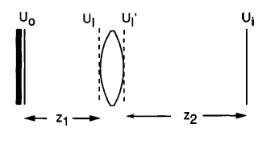
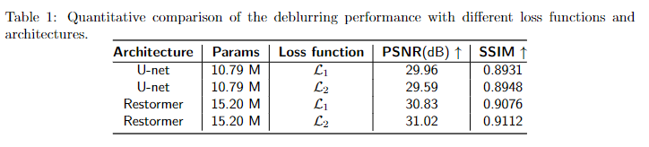

# DeblurNN
Image Deblurring with Neural Networks Using Fourier Optics

More details can be found in my report: [*report*](./report_MS_DSII.pdf)

## Imaging model

In this code, we build a single-lens imaging system derived from Fourier optics.

## Deblurring neural network

We use U-net and Restormer as our deblurring network. The pretrain model can be download in checkpoints folder.

